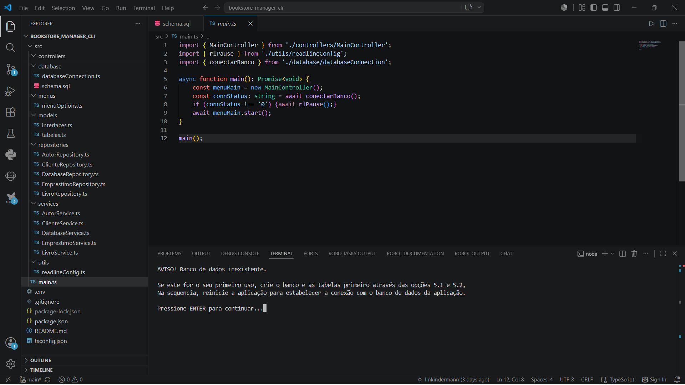
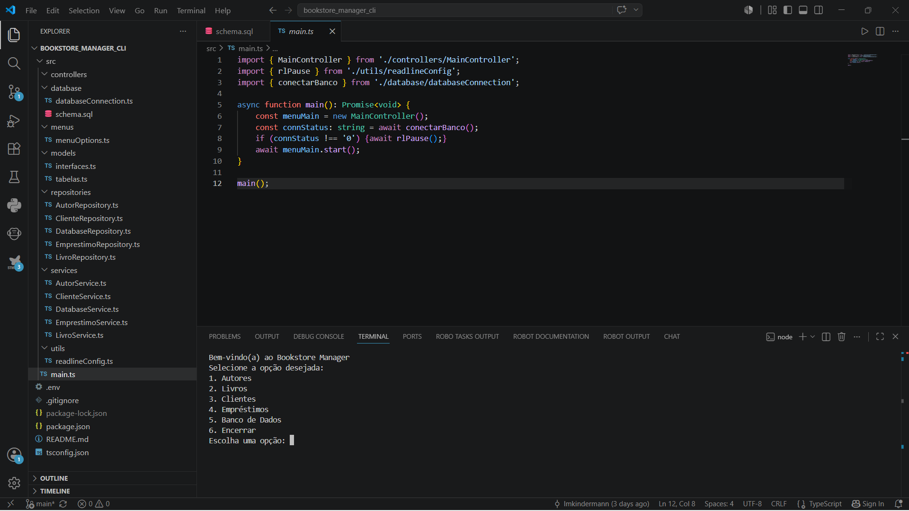
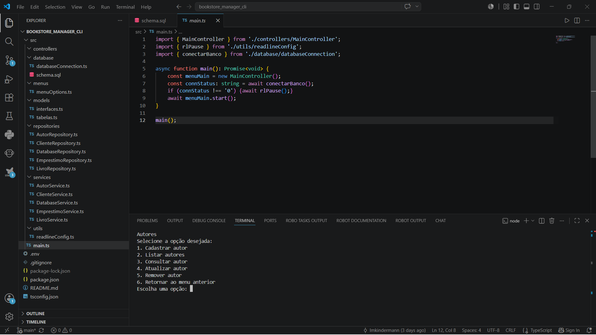
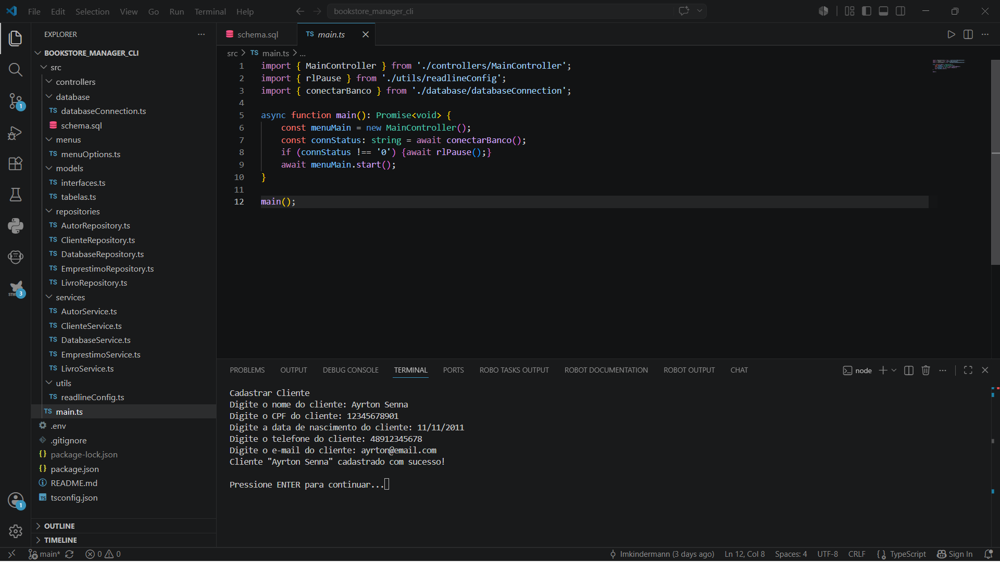
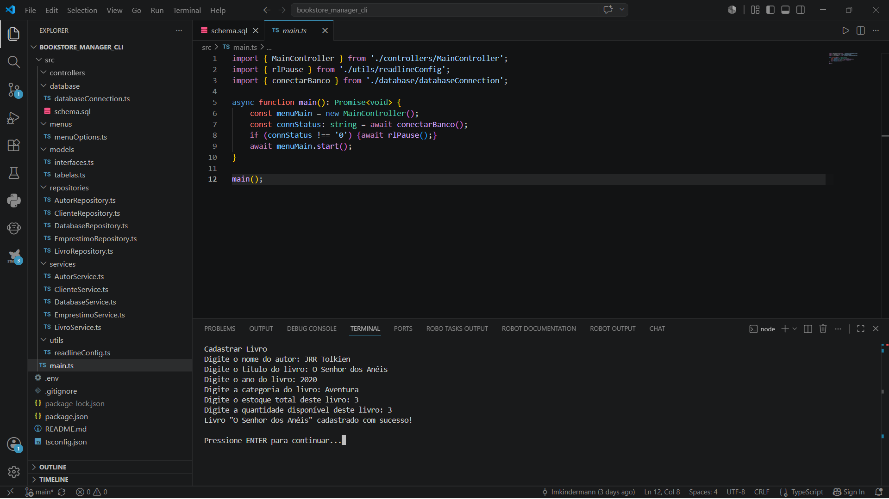
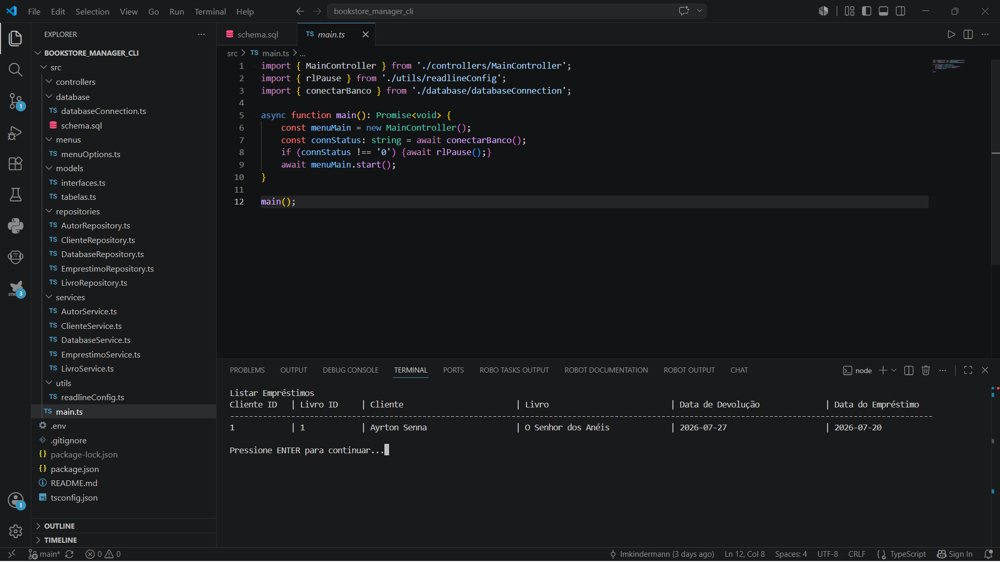

# BookStore Manager CLI #


## Sobre o projeto 

O BookStore Manager CLI é um sistema de gerenciamento de uma pequena livraria, permitindo informatizar o controle de autores, livros, clientes e empréstimos, através de uma aplicação executada via terminal.

A aplicação permite o gerenciamento completo das informações da livraria por meio de menus interativos no terminal, utilizando o PostgreSQL como banco de dados para armazenamento permanente das informações.

O projeto foi desenvolvido como atividade de avaliação no curso de Desenvolvimento de Software Back-End com foco em Node.js, promovido pelo SENAI/SC em parceria com o governo de Santa Catarina, através do programa SCTEC.

## Objetivo

Desenvolver uma aplicação CLI capaz de:
- Gerenciar autores, livros, clientes e empréstimos;
- Persistir informações em um banco de dados PostgreSQL;
- Aplicar regras de negócio durante as operações do sistema;
- Realizar consultas relacionais utilizando SQL;
- Gerar relatórios a partir dos dados armazenados;
- Organizar o código em camadas, promovendo modularização e reutilização;
- Utilizar recursos da linguagem TypeScript, programação orientada a objetos e programação assíncrona;
- Documentar a instalação, execução e utilização da aplicação no arquivo README.md.

## Tecnologias Utilizadas

- **TypeScript:** Adiciona tipagem estática ao Node.js, detectando erros precocemente e melhorando a qualidade do código.
- **TSX e TS-Node:** Executam arquivos TypeScript diretamente durante o desenvolvimento, sem necessidade de compilação manual, agilizando seu fluxo de trabalho.
- **PostgreSQL:** Um banco de dados relacional poderoso e de código aberto para armazenar e gerenciar os dados da sua aplicação.
- **Node-Postgres (PG):** O cliente nativo do PostgreSQL para Node.js, permitindo a execução de consultas SQL brutas e o uso de _connection pooling_ (pool de conexões).
- **Dotenv:** Carrega variáveis ​​de ambiente de forma segura a partir de um arquivo `.env` para o `process.env`.
- **Git e GitHub:** Ferramentas de controle de versão e hospedagem colaborativa de código para gerenciar seu repositório.

## Pré-Requisitos

Este projeto foi desenvolvido, testado e validado utilizando as seguintes ferramentas e versões:

- **pgAdmin 4:** Version 9.15 (Windows 11)
- **VS Code:** Version 1.129.1 (Windows 11)
- **Node.js:** Version 24.18.0
- **Typescript:** Version 6.0.3 
- **tsx:** Version 4.23.1
- **ts-node:** Version 10.9.2
- **pg:**: Version 8.22.0
- **dotenv**: Version 17.4.2
- **npm:**: Version 11.12.1
- **Git:** Version 2.51.2.windows.1

Para a correta operação deste sistema, certifique-se de que as ferramentas acimas estejam configuradas para as versões mencionadas. 

Versões mais recentes podem causar algum tipo de impacto, como o Typescrpt v7.0.2 que possui incompatibilidade com ts-node, limitando a opção de execução do projeto via TSX.

## Instalação

Clone o repositório:
```
- bash
- git clone https://github.com/lmkindermann/bookstore_manager_cli
```

Acesse a pasta do projeto:
```
- code (em uma janela de terminal ou no VS Code)
- cd bookstore_manager_cli OU Open Folder -> Bookstore Manager CLI
```

Instale as dependências: 
```
- npm install pg dotenv
- npm install -D typescript@6.0.3 ts-node @types/node @types/pg
```

## Configuração do Banco de Dados

Existem duas maneiras de configurar o Banco de Dados para esta aplicação:

* Através da CLI do Sistema.
1. Atualize as informações de usuário/senha no arquivo .env
2. Execute a aplicação via Terminal.
3. Se for a 1a vez, um aviso de ausência de banco de dados será exibido
4. Verifique se o postgreSQL pgAdmin está em execução.
5. Verifique se o database padrão "postgres" existe.
6. Navegue nas opções (5).(1) para criar um novo banco de dados.
7. Navegue nas opções (5).(2) para criar as tabelas.
8. Reinicie a aplicação para inicializar o pool de comunicação.

* Através do PostgreSQL
1. Crie um novo database chamado **bookstore_manager**
2. Abra o arquivo ./src/database/schema.sql
3. Execute o código através do Query Tool 
4. Execute a aplicação via Terminal

## Execução

Em ambiente de desenvolvimento: 
```
- npm run dev
```

Em ambiente de produção: 
```
- npm run build
- npm run start
```

## Arquitetura do projeto

A aplicação foi implementado utilizando a estrutura abaixo, com arquivos separados por cada entidade, dentro de cada pasta que representam as camadas que separam e organizam as funcionalidades do sistema.

```
pokedex-typescript-lite/
|
|--src/
|  |--controllers/  (Menus para acesso dos recursos)
|  |  |--AutorController.ts
|  |  |--ClienteController.ts
|  |  |--DatabaseController.ts
|  |  |--EmprestimoController.ts
|  |  |--LivroController.ts
|  |  |--MainController.ts
|  |--database/  (Configuração da conexão com o banco de dados)
|  |  |--databaseConnection.ts
|  |  |--schema.sql
|  |--menus/  (Textos desenvolvidos para a interface com o usuário)
|  |  |--menuOptions.ts
|  |--models/  (Interfaces e estruturas de tabelas de relatórios)
|  |  |--interfaces.ts
|  |  |--tabelas.ts
|  |--repositories/  (Instruções e recursos de comunicação com o banco de dados)
|  |  |--AutorRepository.ts
|  |  |--ClienteRepository.ts
|  |  |--DatabaseRepository.ts
|  |  |--EmprestimoRepository.ts
|  |  |--LivroRepository.ts
|  |--services/  (Tratamento das regras de negócio do sistema)
|  |  |--AutorService.ts
|  |  |--ClienteService.ts
|  |  |--DatabaseService.ts
|  |  |--EmprestimoService.ts
|  |  |--LivroService.ts
|  |--utils/  (Recursos de interface entre sistema e usuário)
|  |  |--readlineConfig.ts
|  |--main.ts  (Script principal para inicialização do sistema)
|--.env  (Configuração da conexão com o banco de dados)
|--.gitignore
|--package.json
|--README.md  (Este documento)
|--tsconfig.json
```

## Funcionalidades

- Gerenciamento completo de informações de uma livraria.
- Interação com menus interativos por texto (CLI).
- Criação, Leitura, Atualização e Remoção de dados.
- Cadastro de Autores, Livros, Clientes e Empréstimos.
- Armazenamento permanente das informações.
- Autores/Livros/Clientes: Funções para Adicionar, Listar, Consultar, Atualizar ou Remover cadastros.
- Empréstimos: Funções para Registrar, Listar, Consultar, Renovar ou Devolver.
- Banco de Dados: Funções para criar uma nova base de dados ou tabelas.
- Relacionamento entre a tabela de autores e livros, e de empréstimos com livros e clientes.
- Tratamento de erros e conformidade com as regras propostas para o sistema.

## Exemplos de Utilização








## Quadro Kanban

https://trello.com/b/m1rTykPP/bookstore-manager-cli
